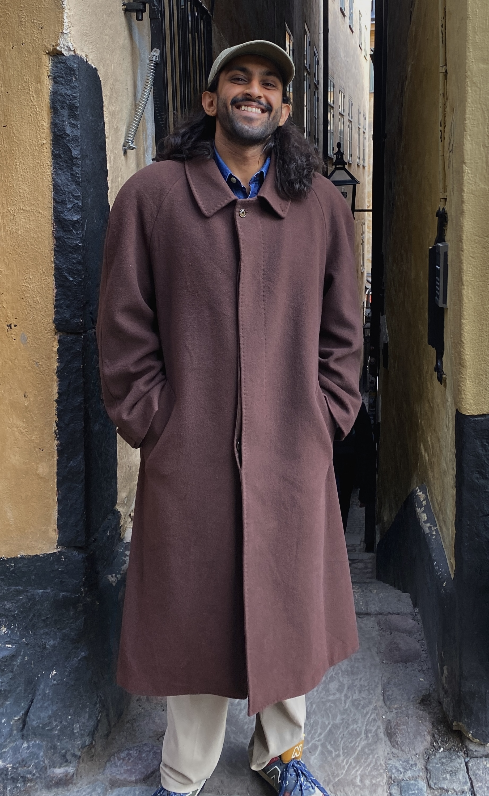

<!-- About Me -->
<section id="about" class="about-section">
  

    

      
    

    

      

        
 Hi there, my name is Sanjiv and welcome to my academic webpage! A bit about me...

        

        I am a PhD student in Category Theory at the <a href="https://www.cst.cam.ac.uk/" target="_blank">University of Cambridge</a> (United Kingdom) as a <a href="https://www.gatescambridge.org/biography/18554/" target="_blank">Gates Cambridge Scholar</a>, under the supervision on <a href="https://www.cl.cam.ac.uk/~mpf23/" target="_blank">Professor Marcelo Fiore</a>. My broad research interests are in Categorical Logic and Categorical Algebra.
        

        

        More specifically, I am currently working on category theoretic models of substructural theories &mdash; such as Lawvere theories and symmetric operads &mdash; as substitution algebras and substitution monoids, generalisations of species of structure, and abstract syntax of binding and second-order theories. I often make use of aspects of symmetric monoidal- and 2-category theory. I also work on internal category theory in the context of categorical algebra.
        

        

        Previously, I completed my BSc, Honours and Masters degrees at the <a href="https://science.uct.ac.za/departments/mathematics-applied-mathematics" target="_blank">University of Cape Town</a> (South Africa) under the supervision of <a href="https://science.uct.ac.za/department-mathematics/contacts/george-janelidze" target="_blank">Professor George Janelidze</a> during which I spent a year at <a href="https://www.uclouvain.be/fr/instituts-recherche/irmp" target="_blank">Université Catholique de Louvain</a> (Belgium) under the supervision of <a href="https://perso.uclouvain.be/marino.gran/" target="_blank">Professor Marino Gran</a>.
        

      

      

        

        Email : <a href="mailto:sanjiv.ranchod@cl.cam.ac.uk" class="about-email">sanjiv.ranchod@cl.cam.ac.uk</a>
        

        

          <a href="https://scholar.google.com/citations?user=mLMt8jsAAAAJ&hl=en&oi=ao" target="_blank" class="btn google-scholar">Scholar</a>
          <a href="https://orcid.org/0000-0003-0334-7010" target="_blank" class="btn orcid">ORCID</a>
        

      

    

  

  

  <a class="card" href="#papers" aria-label="Scroll to Papers section">
    ↓
  </a>

</section>

<!-- Papers -->
<section id="papers" class="papers-section">
  

    <h2 class="section-title card">Papers</h2>
    

    
    
      

        <h4 class="paper-title">
          
            <a href="{{ paper.link }}" target="_blank">{{ paper.title }}</a>
          
            {{ paper.title }}
          
        </h4>
        
 <em>with</em> {{ paper.authors }}

        
{{ paper.journal }}

        
{{ paper.year }}

        

          
            <a class="btn" href="{{ paper.arxiv }}" target="_blank">arXiv</a>
          
          
            <a class="btn" href="{{ paper.pdf }}" target="_blank">PDF</a>
          
        

      

    
    

  

</section>

<!-- Talks & Posters -->
<section id="talks-posters" class="talks-section">
  

    <h2 class="section-title card">Talks & Posters</h2>
    

    
    
      

        <h4 class="talk-title">
          
            <a href="{{ talk.link }}" target="_blank">{{ talk.title }}</a>
          
            {{ talk.title }}
          
        </h4>
        

          <em>{{ talk.type }} at</em> {{ talk.event }}
        

        
Upcoming, {{ talk.year }}

        

          
            <a class="btn" href="{{ talk.abstract }}" target="_blank" rel="noopener">Abstract</a>
          
          
            <a class="btn" href="{{ talk.recording }}" target="_blank" rel="noopener">Recording</a>
          
          
            <a class="btn" href="{{ talk.slides }}" target="_blank" rel="noopener">Slides</a>
          
        

      

    
    

  

</section>
